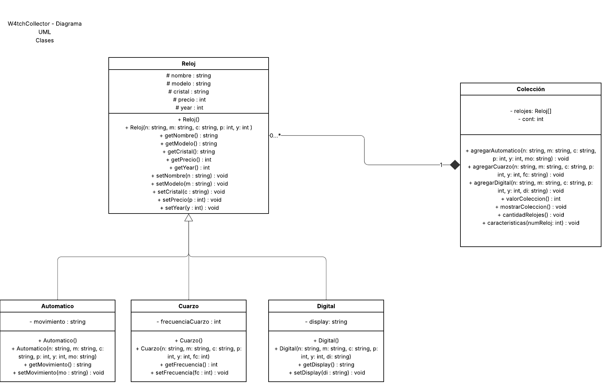

# W4tchCollector
## Contexto y funcionalidad
Este proyecto está hecho para todo aquel coleccionista y amante de los relojes. La idea es poder tener un programa donde puedas guardar todos tus relojes en una colección con sus respectivos datos, como su tipo (ya sea automático/mecánico, digital o de cuarzo), así como su modelo y otros datos más específicos. También puedes consultar cosas claves de tu colección, como su valoración total de precio, consultar cada reloj y sus datos individuales, el tamaño de tu colección, etc. 

## Consideraciones
El programa solo corre en la consola y esta hecho con c++ standard por lo que corre en todos los sistemas operativos

## Casos de fallo
El programa puede llegar a fallar bajo diferentes condiciones, principalmente si se ingresa un tipo de dato distinto al solicitado. De igual manera, el número de relojes está limitado a 100 en la clase colección, por lo que, si se sobrepasa este límite, el programa fallará.

## Diagrama de clases

## Compilacion e instalacion
Para compilar el programa, instala los .h y el MainPrueba.cpp, debido a que en main se incluyen todos los .h, solo es necesario compilar el main.

### Linux

Compilación: `g++ MainPrueba.cpp -o W4C`

Ejecución: `./W4C`

### Windows

Compilación: `g++ MainPrueba.cpp -o W4C.exe`

Ejecución: `.\W4C.exe`
